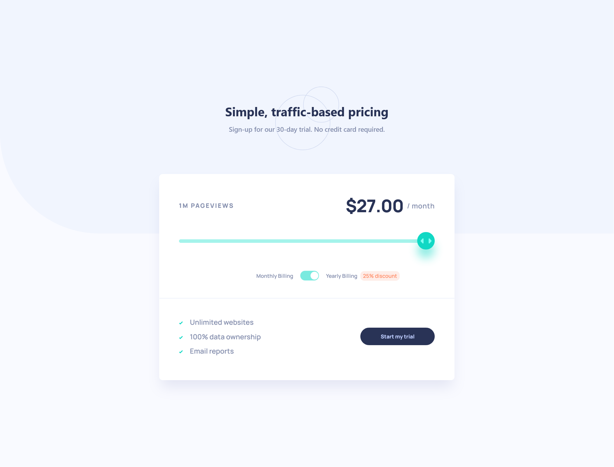

# Frontend Mentor - Interactive pricing component solution

This is a solution to the [Interactive pricing component challenge on Frontend Mentor](https://www.frontendmentor.io/challenges/interactive-pricing-component-t0m8PIyY8). Frontend Mentor challenges help you improve your coding skills by building realistic projects.

## Table of contents

- [Overview](#overview)
  - [The challenge](#the-challenge)
  - [Screenshot](#screenshot)
  - [Links](#links)
- [My process](#my-process)
  - [Built with](#built-with)
  - [What I learned](#what-i-learned)
  - [Continued development](#continued-development)
  - [Useful resources](#useful-resources)
- [Author](#author)

## Overview

### The challenge

Users should be able to:

- View the optimal layout for the app depending on their device's screen size
- See hover states for all interactive elements on the page
- Use the slider and toggle to see prices for different page view numbers

### Screenshot

### Links

- Solution URL: [Add solution URL here](https://your-solution-url.com)
- Live Site URL: [Add live site URL here](https://your-live-site-url.com)

## My process

### Built with

- Semantic HTML5 markup
- CSS custom properties
- Flexbox
- [React](https://reactjs.org/) - JS library
- useContext, useState, useEffect hooks

### What I learned

The biggest take-away from this project was having different component parts in the Pricing card and passing state along to all the individual components using the `useContext` hook.

### Continued development

I really enjoyed and plan on learning more about dynamically rendering the numbers in this component based on wether the user checked a box. It was a good challenge to put together multiple aspects of react to get the desired effect.

### Useful resources

- [w3 How to range sliders](https://www.w3schools.com/howto/howto_js_rangeslider.asp) - This resource helped me to disect the input type range slider and understand the individual parts better. I definitely plan on using this component more in the future.

## Author

- Website - [Add your name here](https://aaronsoto.io)
- Frontend Mentor - [@aaron-soto](https://www.frontendmentor.io/profile/aaron-soto)
- Github - [@aaron-soto](https://github.com/aaron-soto)
- Linkedin - [@aaron-soto1](https://www.linkedin.com/in/aaron-soto1/)
